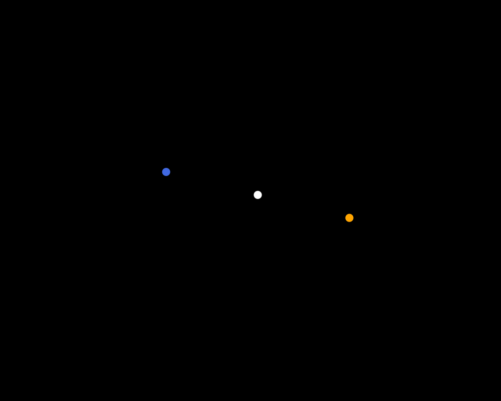

# Three-Body Problem

A numerical simulation of the classical three-body problem using Julia and Newtonian gravity.

The three-body problem describes the motion of three bodies that interact with each other through gravity. Unlike the two-body problem, there is no general closed-form solution for the three-body case, so numerical methods are used to calculate the motion of the bodies over time.

This project solves the equations of motion numerically and stores the position of each body at every time step. The stored positions are then used to plot the trajectories of the three bodies.

## Physics

The acceleration of each body is calculated from the gravitational interaction with the other two bodies.

For body 1,

$$
\mathbf{a}_1 =
Gm_2\frac{\mathbf{r}_2-\mathbf{r}_1}
{|\mathbf{r}_2-\mathbf{r}_1|^3}
+
Gm_3\frac{\mathbf{r}_3-\mathbf{r}_1}
{|\mathbf{r}_3-\mathbf{r}_1|^3}.
$$

The same calculation is performed for the other two bodies.

The equations are then integrated step by step to obtain the new positions and velocities.

The simulation uses dimensionless units, which makes it easier to experiment with different initial conditions without tying the calculation to a particular astronomical system.

## Simulation

The initial conditions specify the mass, position and velocity of each body. For example:

```julia
G = 1.0

m1 = 1.0
m2 = 1.0
m3 = 1.0

r1 = [0.0, 0.5]
r2 = [0.0, -0.5]
r3 = [-0.5, 0.0]

v1 = [-1.0, 0.0]
v2 = [1.0, 0.0]
v3 = [0.0, 0.0]
```

The simulation is run for a chosen number of time steps with a specified time step \(dt\).

At each step:

1. The gravitational acceleration on each body is calculated.
2. The velocities are updated.
3. The positions are updated.
4. The new positions are stored.

The stored position histories can then be used to reconstruct the complete trajectories.

## Trajectories

The simulation keeps a history of the positions of all three bodies:

```text
r1_history
r2_history
r3_history
```

These arrays contain the positions at successive time steps and can be plotted to see the resulting motion.

### Example



The trajectory depends strongly on the initial positions and velocities. Changing the initial conditions can produce very different types of motion.

## Project Structure

```text
three-body-problem/
│
├── src/
│   └── physics.jl
│
├── test/
│   └── ...
│
├── Project.toml
├── Manifest.toml
└── README.md
```

`physics.jl` contains the main physics and simulation code.

`Project.toml` and `Manifest.toml` define the Julia environment and its dependencies.

## Running

Clone the repository and enter the project directory:

```bash
git clone <repository-url>
cd three-body-problem
```

Start Julia and activate the project environment:

```julia
using Pkg
Pkg.activate(".")
Pkg.instantiate()
```

The simulation can then be run by loading the physics code:

```julia
include("src/physics.jl")
```

The initial conditions, timestep and simulation length can be changed to experiment with different configurations.

## Notes

The simulation assumes point masses interacting only through Newtonian gravity. Relativistic effects, collisions and external gravitational fields are not included.

The timestep also affects the numerical result. A timestep that is too large can give inaccurate trajectories, especially when two bodies pass close to each other.

## References

* H. Goldstein, C. Poole and J. Safko, *Classical Mechanics*
* W. H. Press et al., *Numerical Recipes*
* [Julia Documentation](https://docs.julialang.org/)
